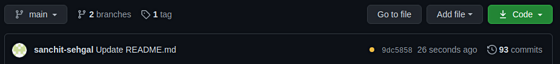
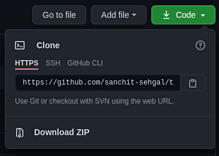
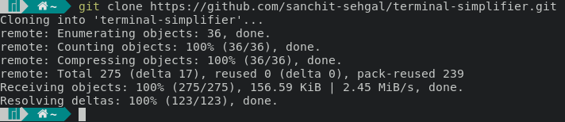

## About Terminal-Simplifier
This program aims to simplify use of the terminal for those with little to no experience using the terminal. In many operating systems, the terminal is always seen as the most "hacky"- several commands can destroy your OS and ruin your computer. In reality, however, the terminal is an extremely simple element in your OS and can greatly increase your productivity if used correctly. In order to use the terminal to its full potential however, you would _usually_ have to learn several commands. By using terminal-simplifier, there's no need to learn the commands- you can let the computer do it all for you. 

Installing this program may seem tricky, but by using the installation guide below, you can have the program up and running in only 10-15 minutes. Once you have it installed, that's it! The terminal is at your command- from productivity commands to playing games, you can do nearly everything with this program. To get started with the installation guide below, open the terminal (**Ctrl+Alt+T** in most cases).

## Installation Guide (Arch-based Distributions)

##### Install Git
Once you have opened your terminal, you need to first install git. In Arch Linux based distributions, git can be installed by typing the following code:
```
sudo pacman -S git --noconfirm
```

Once you have installed git, you need to install Python.
##### Install Python (and Pip)
To install Python (and its package manager- pip), type the following code into your terminal:
```
sudo pacman -S python --noconfirm
```
This will automatically download the latest version of Python onto your system. This is essential to run the program.

##### Install Required Dependencies
To install the dependencies, you first need to clone this repository into our terminal. To do so, press the green code button as seen in the following image:

Make sure you have selected HTTPS as shown below. Then, press the clipboard button to copy the repository link, as seen here:




Once you have copied the link to the repository, you need to head back to the terminal. On a new line, you need to type the following:
```
git clone link
```
where "link" is our copied repository link. You can paste this by pressing **Ctrl+Shift+V**. When you enter this command, you should see something resembling this:

 

Once you have cloned the repository, type the following command into your terminal:
```
cd terminal-simplifier
```

You are now in terminal-simplifier directory which you have just created. Once you have entered the directory, you need to execute our dependency installer by typing the following commands into our terminal:
```
chmod u+x arch-dependencies.sh
```
```
./arch-dependencies.sh
```
Once this command is finished executing, you have successfully installed Terminal Simplifier!

## Installation Guide (Ubuntu + Debiann-based Distributions)

##### Install Git
Once you have opened your terminal, you need to first install git. In Ubuntu and Debian based distributions, git can be installed by typing the following code:
```
sudo apt-get install git
```

##### Install Python (and Pip)
To install Python (and its package manager- pip), type the following code into your terminal:
```
sudo apt-get install python
```
This will automatically download the latest version of Python onto your system. This is essential to run the program.

##### Install Libnotify-Bin
To install this particular dependency, you have to enter your root environment. This can be done by simply entering the following into your terminal:
```
sudo su
```

Once you have entered your root environment, you have to install the dependency using the following command:
```
apt-get install -y libnotify-bin
```

Finally, once this dependency has been installed, you can return to your base environment using this command:
```
exit
```

##### Install Required Dependencies
To install the dependencies, you first need to clone this repository into our terminal. To do so, press the green code button as seen in the following image:

Make sure you have selected HTTPS as shown below. Then, press the clipboard button to copy the repository link, as seen here:


Once you have copied the link to the repository, you need to head back to the terminal. On a new line, you need to type the following:
```
git clone link
```
where "link" is our copied repository link. You can paste this by pressing **Ctrl+Shift+V**. When you enter this command, you should see something resembling this:

 

Once you have cloned the repository, type the following command into your terminal:
```
cd terminal-simplifier
```

You are now in terminal-simplifier directory which you have just created. Once you have entered the directory, you need to execute our dependency installer by typing the following commands into our terminal:
```
chmod u+x deb-dependencies.sh
```
```
./deb-dependencies.sh
```
Once this command is finished executing, you have successfully installed Terminal Simplifier on Debian (or any other Debain-based distro)!

## Run Terminal-Simplifier

##### Arch (and Arch-based Distributions)
To set up the terminal-simplifier runner, you need to first execute the following command **while we are in our "terminal-simplifier directory**:
```
chmod u+x arch-simplifier
```
Once you have creatd an executable file, you can run the program whenever you wish with the following command:
```
./arch-simplifier
```
You have fully installed and ran Terminal Simplifier on Arch Linux! Congratulations!

##### Debian/Ubuntu (and Debian-based Distributions)
To set up the terminal-simplifier runner, you need to first execute the following command **while we are in our "terminal-simplifier directory**:
```
chmod u+x deb-simplifier
```
Once you have creatd an executable file, you can run the program whenever you wish with the following command:
```
./deb-simplifier
```
You have fully installed and ran Terminal Simplifier on Debian! Congratulations!

## Troubleshooting Guide
Throughout the installation of this program, your terminal may ask you to enter your "sudo" password. This is nothing to be afraid of. Unless you specifically set a "sudo" password when you installed your Linux distribution, it will normally be automatically set to your computer's login password.

If there are any other concerns/issues with installing the program, please send a request in the Issues tab of this repository. I will attend to it as soon as I can.

## License
This program and its corresponding code is covered under the MIT License. For more information on the license, [view LICENSE.md here.](https://github.com/sanchit-sehgal/terminal-simplifier/blob/main/LICENSE)

## Wiki
For this repository's wiki, view [this page.](https://github.com/sanchit-sehgal/terminal-simplifier/wiki/Introduction)

## Other Important Documents
There are a few other documents that you may find important. 

- To contribute to this repository, please reference [this page.](/CONTRIBUTING.md) 
- To learn about security and malware prevention for this project, please view [this page.](SECURITY.md) 
- To view this repository's Code of Conduct, please view [this page.](/CODE_OF_CONDUCT.md) 
- Finally, to view any Python pip packages that are supported by this repository, please view the folder titled ".github" that can be found in the contents of this repository (or can be found at [this link](https://github.com/sanchit-sehgal/terminal-simplifier/tree/main/.github/workflows)).

## About the Creator
Greetings! My name is Sanchit Sehgal, and I am a sophomore in a high school in Atlanta, Georgia, in the United States. Initially, I created this project to help simplify the terminal for myself- when I first installed Linux, I was completely unfamiliar with it. However, while creating this project, I learned a great deal about how useful the terminal is and began using it daily in my workflow. 

Since then, I have decided to publish code (2168 lines of it, to be exact) that I have written to help people who were in a similar position to myself not long ago. This program greatly simplifies the terminal for those who may be intimidated by it and assumes a much more approachable take on it. I hope that you can find this terminal simplifier as useful as I do. 

To contact me directly, please reach out to me at: sanchit830sehgal@gmail.com
